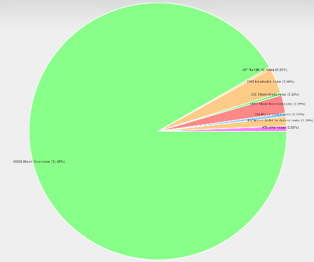
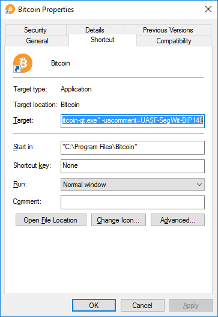

# BIP148 FAQ

### What is BIP148?

BIP148 is a UASF that is designed to cause the existing SegWit MASF deployment to cause activation in all existing SegWit capable node software (which currently is 80% of the network nodes).
How does BIP148 Work?
From August 1st, 2017, miners are required to signal readiness for SegWit by creating blocks with the version bit 1. This will cause all SegWit ready nodes, which make up over 80% of the network, to activate and begin enforcement.
Link for reference: [luke.dashjr.org/programs/bitcoin/files/charts/software.html](http://luke.dashjr.org/programs/bitcoin/files/charts/software.html). Miners must also check blocks prior to their own and ensure that they also signal for SegWit, and only build on those blocks.

### What are companies saying about BIP148?

Company|Category|Support Type|ANN.|
 :--- | :--- | :--- | :---:
 [Abra](https://www.goabra.com) |  Worldwide payments | Support | [proof](https://twitter.com/billbarhydt/status/851855874855391232)
 [Bitcoin Embassy.io](https://bitcoinembassy.ca/) || Support |[proof](https://twitter.com/francispouliot_/status/852554864144109569)
 [BitCoinReminder](https://bitcoinreminder.com/)  | Tool | Support | [proof](https://www.reddit.com/r/Bitcoin/comments/642n66/bitcoinremindercom_supports_bip148_and_a_fix/)
 [Bitfury](http://bitfury.com/) | Miner | Support | [proof](https://news.bitcoin.com/bitfury-mines-block-signaling-uasf-segwit/)
 [BitKong](https://bitkong.com/) | Casino | Support | [proof](https://bitkong.com/segwit.txt)
 [BitPay](https://bitpay.com) | Payment processor | Interest | [proof](https://cointelegraph.com/news/bitpay-ceo-supports-user-activated-soft-fork-hints-at-off-chain-expansion)
 [Bitrated](https://twitter.com/bitrated/status/852414265134907392) | Identity & consumer protection | Support | [proof](https://twitter.com/bitrated/status/852414265134907392)
 [Bitrefill](https://www.bitrefill.com) |Exchange| Support | [proof](https://twitter.com/bitrefill/status/851818821946048512)
 [Bitvest](https://bitvest.io/) | |Support | [proof](https://bitvest.io/segwit)
 [Blockonomics](https://www.blockonomics.co) |Explorer| Support|  [proof](https://twitter.com/blockonomics_co/status/851770427529670658)
 [Bustabit](#) | Casino|Interest|[proof](https://www.reddit.com/r/Bitcoin/comments/63otrp/gregory_maxwell_major_asic_manufacturer_is/dfw02tg/)
 [Bylls](https://bylls.com/) | Service | Support |[proof](https://twitter.com/francispouliot_/status/852554864144109569)
 [CoinGate](https://coingate.com) | Payment Processor | Support | [proof](https://blog.coingate.com/2017/04/coingate-supports-segwit-and-uasf/)
 [Coinkite](http://coinkite.com) | Hardware/Software | Support| [proof](https://twitter.com/coinkite/status/851822761794260992)
 [Coinomi](https://coinomi.com/) | Multi-currency Wallet | Support| [proof](https://twitter.com/CoinomiWallet/status/852130791362637825)
 [Freedom Node](https://freedomnode.com/) | Education | Support| [proof](https://freedomnode.com/bitcoin-core-support.txt)
 [JoinMarket](https://github.com/JoinMarket-Org/joinmarket) | Mixer | Support| [proof](https://twitter.com/joinmarket/status/851177740900368385)
 [Microsoft](http://microsoft.com)| Decentralized Identity dpt.|Support|[proof](https://twitter.com/csuwildcat/status/851832163792150528)
 [Prasos](https://prasos.fi) | Bitcoin broker | Support | [proof](https://twitter.com/prasosltd/status/852104011767566336)
 [Samourai Wallet](https://samouraiwallet.com/) | Wallet| Support| [proof](https://twitter.com/SamouraiWallet/status/851005717070917633)
 [Satoshi Counter](https://satoshicounter.com/) | Broker | Support |[proof](https://twitter.com/francispouliot_/status/852554864144109569)
 [Satoshi Portal](http://satoshiportal.com) | Financial services | Support|[proof](https://twitter.com/francispouliot_/status/850474196635439105)
 [Stampery Inc.](https://stampery.com) | Timestamping| Support |[proof](https://twitter.com/StamperyCo/status/852097157951873025)
 [Trezor](https://trezor.io/) | Hardware Wallet | Ready | [proof](https://twitter.com/slushcz/status/851502735736418304)
 [Vaultoro](https://www.vaultoro.com) | Bitcoin & gold exchange | Support | [proof](https://twitter.com/Vaultoro/status/851370469018284034)
 [Walltime](https://walltime.info/)|| Support |[proof](https://pastebin.com/raw/FeNHqySX)
 [yogh.io](http://yogh.io) | Explorer| Support |[proof](http://srv1.yogh.io/#json:getnetworkinfo)
 
 *[Add your business here by creating a pull request (must include public announcement link)](https://github.com/OPUASF/UASF/pulls)*
 
### Why BIP148 and not a direct flag day UASF for Segwit?

To be clear, BIP148 is a soft fork that requires miners to activate the existing SegWit deployment. This is not the standard for UASF because normally nodes would just begin enforcement on a given "flag day". However, almost 80% of the network has already upgraded to SegWit capable node software, in anticipation of miner triggered activation. A new "SegWit UASF" deployment would require all nodes to upgrade again which will take considerable time. For this reason, the shortened route to SegWit activation is to require blocks to signal for SegWit activation. In general, the block signalling mechanism is only supposed to be a coordination method that makes accelerated activation possible. In 2012, P2SH was activated by UASF with a simple flag day.

BIP148 was created to avoid having to force most users to upgrade their software. A vast majority of the nodes currently deployed are aware of the BIP9 signalling for SegWit. BIP148 is designed to motivate miners to signal for SegWit so that it is activated in a way that even users who are not running BIP148 will get the benefits of the activation of SegWit. For more information on the benefits of SegWit, please visit: [segwit.org](https://segwit.org).

### What do users need to do to enforce BIP148?

It is recommended that users do not update unless an economic majority commits to updating and users are aware of the risks and mitigations of a failed UASF deployment.

Users aware of the risks and who want to commit should use clients that enforce BIP148. Users that run full nodes would upgrade to one that enforces BIP148, or run their node behind an upgraded border node. Users of light clients (like mobile wallets) should check with each vendor to see their support for BIP148. We plan on documenting any public responses from wallets regarding BIP148 support.
Satoshi Portal Electrum Server for UASF: 158.69.102.114 port 50002

### What do miners need to do to enforce BIP148?

Prior to August 1st, 2017, miners should either:

1. Update their node software to a BIP148-enforcing version; or
1. Run a BIP148 border node to filter out invalid blocks, and update their existing mining software to produce blocks with version 1 bit enabled, to vote for Segwit activation

### What are the various scenarios that could happen from BIP148?

BIP148 requires support from the economic majority, particularly exchanges and wallets. If this does not occur, node software supporting BIP148 should not be run after August 1st as it will cause a chain split leading to the abandonment of BIP148.
There are strong economic incentives in the Bitcoin system for nodes to cooperate and remain in consensus to prevent chain splits. If the economic majority is signalling as of August 1st, miners have many incentives to follow along. Not following along would make it difficult to sell coins mined after August 1st as the blocks would not be accepted by the economic majority. Essentially, miners would be producing an altcoin not recognized by users and exchanges, making them less useful and in lower demand.

Some miners could opt to ignore the BIP148 rule and attempt to split the chain, but this would require a majority of miners who would be out of consensus from the rest of the economic majority.

If a majority of hash power follows BIP148, all nodes will follow the chain regardless of if they are running BIP148. Non-compliant blocks will be orphaned. All SegWit nodes will eventually activate SegWit.

If a minority of the hash power (under 51%) follows BIP148, nodes running BIP148 will be fine, but those not running BIP148 will be out of consensus with the rest of the economy. In this scenario, the more of the economy that runs BIP148, the better. Miners will find it difficult to sell their coins leading economically motivated miners to start enforcing BIP148.

### Why was the date of August 1, 2017 chosen?

Because BIP9 is time based, BIP148 needs to account for the possibility for some of the hash power to exit (eg. to mine another fork) which would make block intervals longer. The August 1st date allows for the economic majority to successfully activate SegWit. Theoretically, if the hashpower drops by up to 85%, it might take up to 13 weeks to complete an activation period. In this scenario, SegWit will still activate for all BIP148 compliant nodes.

### How can we show support for BIP148?

The best way to show support is to champion it through social media (Twitter, Facebook, etc...) and petition businesses and wallets to support it. Many users are also altering their node's user agent string to include BIP148.

To signal #BIP148 on Linux on your node before binaries are released:

`echo "uacomment=UASF-SegWit-BIP148" >> ~/.bitcoin/bitcoin.conf && bitcoin-cli stop && sleep 5 && bitcoind`

To signal #BIP148 on Windows, you can edit the shortcut for Bitcoin as follows:

_N.B. This will not enforce UASF on your node; it will only signal that you support it at this stage._

### Can BIP148 be cancelled?

Yes. In the event that the economic majority does not support BIP148, users should remove software that enforces BIP148. A flag day activation for SegWit would be the next logical steps and require coordination of the community, most likely towards the end of 2018.

### Is BIP148 a hard fork?

No, BIP148 isn’t a hard fork. A hard fork is often confused with a chain split. A hard fork is a type of chain split where the rules are loosened to allow previously disallowed blocks or transactions. A soft fork is a tightening of the rules. A soft fork will result in a converged chain if the majority of hashpower enforces its rules. For a more detailed explanation of types of forks and chain splits, see  [Chain Splits and Resolutions](https://medium.com/@alpalpalp/chain-splits-and-resolutions-d3398bddf4ab).

### Where do I download software that enforces BIP148?

Successful User Activated Soft Forks require a strong consensus from the economy to be successful.  BIP148 also is subject to changes as it is reviewed, so some minor details may change before it is ready.  Until there is sufficient consensus, it is not advised to use any binaries that implement BIP148.  However, the BIP148 reference can be applied for testing and review purposes.  If you want to signal support, change your user agent comment to be "UASF-SegWit-BIP148", along with communicating with other Bitcoin users that you support BIP148.

